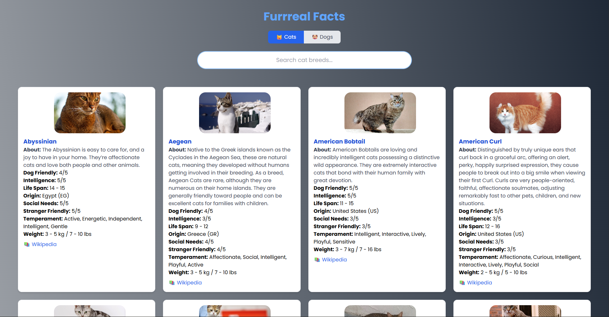
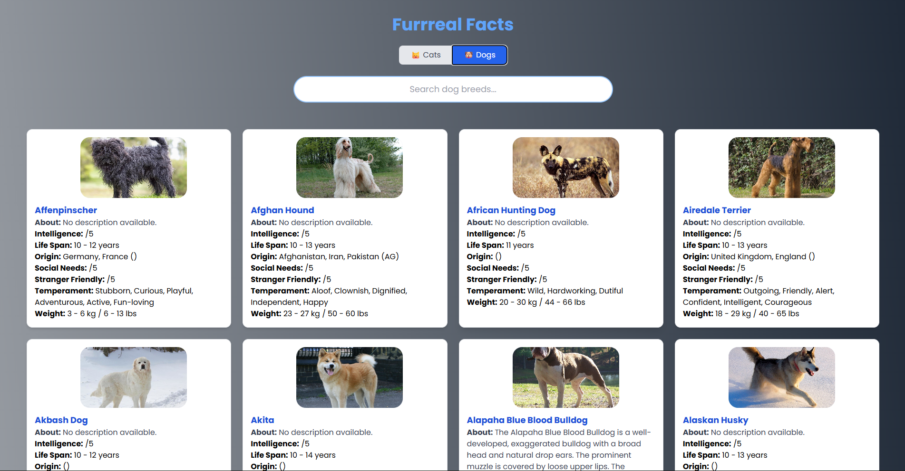

<p align="center">
  
</p>

# 🐾 Furreal Facts — Discover the World of Cats 🐱 & Dogs 🐶

[](https://opensource.org/licenses/MIT)


[](https://reactjs.org/)
[](https://www.typescriptlang.org/)
[](https://tailwindcss.com/)
[](https://create-react-app.dev/)
[](https://furreal-facts.vercel.app)
[](https://github.com/nxora)
[](https://github.com/nxora/furreal-facts/stargazers)
[](https://github.com/nxora/furreal-facts/issues)
[](https://github.com/nxora/furreal-facts/network/members)

> 🧠 **Furreal Facts** — an elegant, responsive React + TypeScript app that brings fascinating data about cats and dogs straight from **The Cat API** and **The Dog API**. Search, filter, and explore hundreds of breeds — all wrapped in a clean, Tailwind-powered interface.

---

## ✨ Preview

| 🐱 Cat Breeds | 🐶 Dog Breeds |
|---------------|---------------|
|  |  |

---

## 🌟 Features

- 🔍 **Smart Search** — find breeds instantly by name  
- 🐾 **Unified UI** — browse cats & dogs in one place  
- 📊 **Detailed Info** — traits, origin, intelligence, friendliness, and more  
- 🌐 **Wikipedia Links** — quick deep dives for curious readers  
- 🎨 **Tailwind Styling** — lightweight, modern, responsive design  
- ⚙️ **Dynamic Data** — live data from APIs, no hardcoding  
- 🔒 **Secure Environment Variables** via `.env`  
- 🧠 **100% TypeScript** — type-safe from start to finish  

---

## 🧩 Tech Stack

| Tech | Role |
|------|------|
| ⚛️ **React (CRA)** | Core frontend framework |
| 🟦 **TypeScript** | Static typing & type safety |
| 💨 **Tailwind CSS** | Styling and responsive layouts |
| 🐕 **The Dog API** | Dog breed data |
| 🐈 **The Cat API** | Cat breed data |
| 🌍 **Vercel** | Hosting and continuous deployment |

---

## 🚀 Getting Started

### 1️⃣ Clone the Repository
```bash
git clone https://github.com/nxora/furreal-facts.git
cd furreal-facts
2️⃣ Install Dependencies
npm install

3️⃣ Get your free api keys from
[Dog Api](https://dogapi.dog/api/v2/breeds)
[Cat Api](https://api.thecatapi.com/v1/breeds)
add into respective api-key blocks in code

4️⃣ Run the App
npm start


Now visit 👉 http://localhost:3000
 in your browser.

 🏆 Achievements

✅ Unified cats & dogs under one seamless UI
✅ Mobile-first responsive design
✅ Zero hardcoded data — fully API-driven
✅ Secure API key handling
✅ Clean architecture with reusable components
✅ TypeScript strict mode enabled

🤝 Contributing

Contributions, feedback, and ideas are always welcome!
If you’d like to help improve Furreal Facts, follow these steps:

🍴 Fork the repo

🌿 Create a new branch:

git checkout -b feature/your-feature


💾 Commit your changes:

git commit -m "Added your amazing feature"


🚀 Push and open a pull request!

👨‍💻 About the Developer

Hi there! I’m nxora
 👋
A passionate developer, designer, and creator on a mission to build tools that blend creativity, utility, and technology.

💡 I love:

Exploring APIs and data-driven projects

Designing sleek UIs with Tailwind CSS

Sharing knowledge and building open-source projects

“Code with passion, design with purpose.” — nxora

📜 License

Licensed under the MIT License
 — free for personal and commercial use.

⭐ If you like this project, please give it a star!
It motivates me to keep building awesome open-source tools. 💫

🐕 Made with love by @nxora
 💙